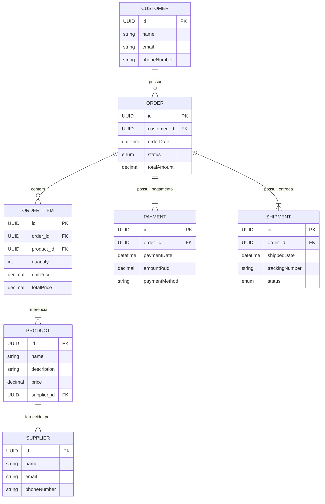

# Order Manager API

## Índice
1. [Descrição do Projeto](#descricao-do-projeto)
2. [Tecnologias Utilizadas](#tecnologias-utilizadas)
3. [Estrutura do Projeto](#estrutura-do-projeto)
4. [Configurações](#configuracoes)
5. [Endpoints das Controllers](#endpoints-das-controllers)
6. [Exceções Tratadas](#excecoes-tratadas)
7. [Diagrama de Entidade Relacional (DER)](#diagrama-de-entidade-relacional)
8. [Conclusão](#conclusao)

---

## Descrição do Projeto
A **Order Manager API** é uma aplicação robusta e escalável projetada para o gerenciamento de pedidos. Ela possibilita operações completas para criação, atualização, remoção e consulta de pedidos, produtos, fornecedores, pagamentos e entregas.

A API foi desenvolvida utilizando **Spring Boot 3.4.2**, garantindo alta performance, escalabilidade e segurança. A persistência é gerenciada pelo **PostgreSQL**, um banco de dados relacional eficiente, e a documentação é gerada automaticamente através do **SpringDoc OpenAPI**. Além disso, a aplicação conta com caching embutido para otimização do desempenho e auditoria das operações.

A arquitetura do sistema foi desenvolvida seguindo princípios SOLID e padrões RESTful, garantindo modularidade e facilidade na manutenção.

---

## Tecnologias Utilizadas
- **Java 21**
- **Spring Boot 3.4.2**
- **Spring Data JPA**
- **Spring Validation**
- **Spring Boot Actuator**
- **PostgreSQL 42.7.4**
- **Lombok 1.18.36**
- **MapStruct 1.6.3**
- **SpringDoc OpenAPI 2.2.0**
- **Maven 3.8.1**

---

## Estrutura do Projeto
```
ordermanager/
│   .gitattributes
│   .gitignore
│   HELP.md
│   mvnw
│   mvnw.cmd
│   pom.xml
│   README.md
│
├───.mvn
│   └───wrapper
│           maven-wrapper.properties
│
└───src
    ├───main
    │   ├───java
    │   │   └───br
    │   │       └───com
    │   │           └───ambevtech
    │   │               └───ordermanager
    │   │                   │   OrderManagerApplication.java
    │   │                   │
    │   │                   ├───config
    │   │                   │       SwaggerConfig.java
    │   │                   │
    │   │                   ├───controller
    │   │                   │       OrderController.java
    │   │                   │       ProductController.java
    │   │                   │       SupplierController.java
    │   │                   │
    │   │                   ├───dto
    │   │                   │       CustomerRequestDTO.java
    │   │                   │       CustomerResponseDTO.java
    │   │                   │       OrderHistoryRequestDTO.java
    │   │                   │       OrderHistoryResponseDTO.java
    │   │                   │       OrderItemRequestDTO.java
    │   │                   │       OrderItemResponseDTO.java
    │   │                   │       OrderRequestDTO.java
    │   │                   │       OrderResponseDTO.java
    │   │                   │       PaymentRequestDTO.java
    │   │                   │       PaymentResponseDTO.java
    │   │                   │       ProductRequestDTO.java
    │   │                   │       ProductResponseDTO.java
    │   │                   │       ShipmentRequestDTO.java
    │   │                   │       ShipmentResponseDTO.java
    │   │                   │       SupplierRequestDTO.java
    │   │                   │       SupplierResponseDTO.java
    │   │                   │
    │   │                   ├───exception
    │   │                   │       CustomerNotFoundException.java
    │   │                   │       OrderNotFoundException.java
    │   │                   │       ProductNotFoundException.java
    │   │                   │       ShipmentNotFoundException.java
    │   │                   │       SupplierNotFoundException.java
    │   │                   │
    │   │                   ├───mapper
    │   │                   │       CustomerMapper.java
    │   │                   │       OrderHistoryMapper.java
    │   │                   │       OrderItemMapper.java
    │   │                   │       OrderMapper.java
    │   │                   │       PaymentMapper.java
    │   │                   │       ProductMapper.java
    │   │                   │       ShipmentMapper.java
    │   │                   │       SupplierMapper.java
    │   │                   │
    │   │                   ├───model
    │   │                   │   │   Customer.java
    │   │                   │   │   Order.java
    │   │                   │   │   OrderHistory.java
    │   │                   │   │   OrderItem.java
    │   │                   │   │   Payment.java
    │   │                   │   │   Product.java
    │   │                   │   │   Shipment.java
    │   │                   │   │   Supplier.java
    │   │                   │   │
    │   │                   │   └───enums
    │   │                   │           OrderStatus.java
    │   │                   │           PaymentStatus.java
    │   │                   │           ShipmentStatus.java
    │   │                   │
    │   │                   ├───repository
    │   │                   │       CustomerRepository.java
    │   │                   │       OrderHistoryRepository.java
    │   │                   │       OrderItemRepository.java
    │   │                   │       OrderRepository.java
    │   │                   │       PaymentRepository.java
    │   │                   │       ProductRepository.java
    │   │                   │       ShipmentRepository.java
    │   │                   │       SupplierRepository.java
    │   │                   │
    │   │                   └───service
    │   │                           CustomerService.java
    │   │                           OrderService.java
    │   │                           ProductService.java
    │   │                           ShipmentService.java
    │   │                           SupplierService.java
    │   │
    │   └───resources
    │       │   application.yml
    │       │
    │       └───db
    │           └───migration
    │                   V1__create_orders_table.sql
    │
    └───test
        └───java
            └───br
                └───com
                    └───ambevtech
                        └───ordermanager
                                OrderManagerApplicationTests.java
```

---

## Configurações

### `application.yml`
```yaml
server:
  port: 8080

spring:
  application:
    name: order-manager

  datasource:
    url: jdbc:postgresql://localhost:5432/ordermanager
    username: postgres
    password: passw@rd

  jpa:
    hibernate:
      ddl-auto: update
    show-sql: true
    database-platform: org.hibernate.dialect.PostgreSQLDialect

springdoc:
  api-docs:
    path: /v3/api-docs
  swagger-ui:
    path: /swagger-ui.html

management:
  endpoints:
    web:
      exposure:
        include: "*"
  health:
    show-details: always
```

---

## Endpoints das Controllers

### `SupplierController`
- `GET /api/suppliers` → Lista todos os fornecedores
- `GET /api/suppliers/{id}` → Obtém um fornecedor pelo ID
- `POST /api/suppliers` → Cria um novo fornecedor
- `PUT /api/suppliers/{id}` → Atualiza um fornecedor existente
- `DELETE /api/suppliers/{id}` → Remove um fornecedor

### `ProductController`
- `GET /api/products` → Lista todos os produtos
- `GET /api/products/{id}` → Obtém um produto pelo ID
- `POST /api/products` → Cria um novo produto
- `PUT /api/products/{id}` → Atualiza um produto existente
- `DELETE /api/products/{id}` → Remove um produto

### `OrderController`
- `GET /api/orders` → Lista todos os pedidos
- `GET /api/orders/{id}` → Obtém um pedido pelo ID
- `GET /api/orders/customer/{customerId}` → Obtém os pedidos de um cliente
- `POST /api/orders` → Cria um novo pedido

---

## Exceções Tratadas
- **SupplierNotFoundException** → Lançada quando um fornecedor não é encontrado.
- **ProductNotFoundException** → Lançada quando um produto não é encontrado.
- **OrderNotFoundException** → Lançada quando um pedido não é encontrado.
- **CustomerNotFoundException** → Lançada quando um cliente não é encontrado.
- **ShipmentNotFoundException** → Lançada quando uma entrega não é encontrada.

---

## Diagrama de Entidade Relacional


---

## Conclusão
A **Order Manager API** é uma solução eficiente para o gerenciamento de pedidos, oferecendo operações essenciais para cadastro, consulta e atualização de fornecedores, produtos, pedidos, pagamentos e entregas.

A implementação segue boas práticas de desenvolvimento, utilizando **Spring Boot**, **PostgreSQL**, e **MapStruct** para garantir performance e manutenção eficiente. Além disso, a documentação via **Swagger** facilita a integração e consumo da API por outros sistemas.

Com um design modular, um banco de dados relacional bem estruturado e uma arquitetura escalável, esta API se apresenta como uma solução confiável e de fácil expansão para atender novas demandas no futuro.

