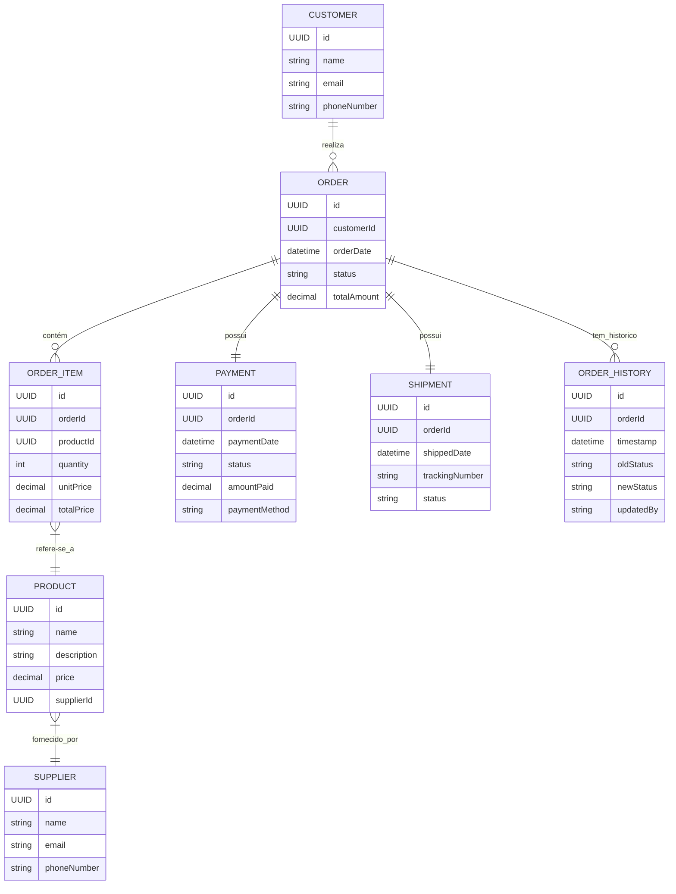

# Order Manager API

## Índice
1. [Descrição](#descrição)
2. [Estrutura do Projeto](#estrutura-do-projeto)
3. [Tecnologias Utilizadas](#tecnologias-utilizadas)
4. [Configurações](#configurações)
5. [Endpoints](#endpoints)
6. [Exceções](#exceções)
7. [Diagrama de Entidade-Relacionamento (DER)](#diagrama-de-entidade-relacionamento-der)

## Descrição
A **Order Manager API** é um sistema desenvolvido em **Spring Boot** para gerenciar pedidos de compra. Ele permite a criação, atualização, recuperação e exclusão de fornecedores, produtos, clientes, pedidos e envios. A API fornece endpoints RESTful e utiliza o **PostgreSQL** como banco de dados.

## Estrutura do Projeto
```
ordermanager/
├── src/main/java/br/com/ambevtech/ordermanager/
│   ├── controller/      # Controllers da API
│   ├── dto/             # Data Transfer Objects (DTOs)
│   ├── exception/       # Exceções personalizadas
│   ├── mapper/          # Mapeadores entre entidades e DTOs
│   ├── model/           # Modelos JPA
│   │   ├── enums/       # Enumerações do sistema
│   ├── repository/      # Repositórios JPA
│   ├── service/         # Serviços da aplicação
│   ├── config/          # Configurações da API
│   ├── OrderManagerApplication.java  # Classe principal
├── src/main/resources/
│   ├── application.yml  # Configurações da aplicação
│   ├── static/          # Arquivos estáticos (se houver)
├── pom.xml              # Dependências Maven
```

## Tecnologias Utilizadas
- **Java 21**
- **Spring Boot 3.4.2** (Web, JPA, Validation, Cache, Actuator)
- **PostgreSQL 42.7.4**
- **SpringDoc OpenAPI 2.2.0** (Swagger UI)
- **MapStruct 1.6.3** (Mapeamento de DTOs)
- **Lombok 1.18.36** (Redução de boilerplate)
- **Maven**

## Configurações
Arquivo `application.yml`:
```yaml
server:
  port: 8080

spring:
  datasource:
    url: jdbc:postgresql://localhost:5432/ordermanager
    username: postgres
    password: passw@rd
  jpa:
    hibernate:
      ddl-auto: update
    show-sql: true
    database-platform: org.hibernate.dialect.PostgreSQLDialect

springdoc:
  api-docs:
    path: /v3/api-docs
  swagger-ui:
    path: /swagger-ui.html

management:
  endpoints:
    web:
      exposure:
        include: "*"
  health:
    show-details: always
```

## Endpoints
### SupplierController (`/api/suppliers`)
- **GET `/`** - Retorna todos os fornecedores paginados
- **GET `/{id}`** - Retorna um fornecedor por ID
- **POST `/`** - Cria um novo fornecedor
- **PUT `/{id}`** - Atualiza um fornecedor
- **DELETE `/{id}`** - Exclui um fornecedor

### ProductController (`/api/products`)
- **GET `/`** - Retorna todos os produtos paginados
- **GET `/{id}`** - Retorna um produto por ID
- **POST `/`** - Cria um novo produto
- **PUT `/{id}`** - Atualiza um produto
- **DELETE `/{id}`** - Exclui um produto

### OrderController (`/api/orders`)
- **GET `/`** - Retorna todos os pedidos paginados
- **GET `/{id}`** - Retorna um pedido por ID
- **GET `/customer/{customerId}`** - Retorna pedidos de um cliente específico
- **POST `/`** - Cria um novo pedido

## Exceções
A API possui exceções personalizadas para erros específicos:
- **SupplierNotFoundException** - Fornecedor não encontrado
- **ProductNotFoundException** - Produto não encontrado
- **OrderNotFoundException** - Pedido não encontrado
- **CustomerNotFoundException** - Cliente não encontrado
- **ShipmentNotFoundException** - Entrega não encontrada

Todas as exceções retornam status **404 Not Found** e mensagens descritivas.

## Diagrama de Entidade-Relacionamento (DER)
Aqui está o Diagrama de Entidade-Relacionamento para o projeto:


## Conclusão
A **Order Manager API** é um sistema robusto para gerenciamento de pedidos, oferecendo endpoints bem definidos, autenticação, logs de eventos e integração com PostgreSQL. O código segue boas práticas e utiliza tecnologias modernas para garantir performance e escalabilidade.

