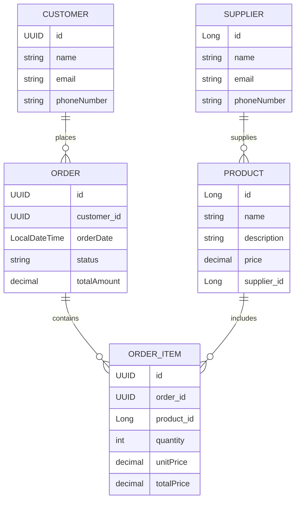

# Order Manager API

## Índice
1. [Descrição](#descrição)
2. [Tecnologias Utilizadas](#tecnologias-utilizadas)
3. [Estrutura do Projeto](#estrutura-do-projeto)
4. [Configurações](#configurações)
    - [application.yml](#applicationyml)
    - [pom.xml](#pomxml)
5. [Endpoints](#endpoints)
    - [SupplierController](#suppliercontroller)
    - [ProductController](#productcontroller)
    - [OrderController](#ordercontroller)
6. [Tratamento de Exceções](#tratamento-de-exceções)
7. [Diagrama de Entidade-Relacionamento](#diagrama-de-entidade-relacionamento)

---

## Descrição
O **Order Manager API** é um sistema desenvolvido para gerenciar pedidos, fornecedores, produtos e pagamentos de forma eficiente e escalável. A API permite criar, atualizar, excluir e listar pedidos, clientes, fornecedores e produtos. Utiliza o banco de dados PostgreSQL e fornece documentação via Swagger UI.

---

## Tecnologias Utilizadas
- **Java 21**
- **Spring Boot 3.4.2**
- **Spring Data JPA**
- **PostgreSQL**
- **Lombok**
- **Spring Boot Actuator**
- **SpringDoc OpenAPI**
- **MapStruct**

---

## Estrutura do Projeto

```
ordermanager/
│── src/main/java/br/com/ambevtech/ordermanager/
│   ├── controller/       # Controladores REST
│   ├── service/          # Serviços de negócio
│   ├── repository/       # Repositórios JPA
│   ├── model/            # Modelos de entidade
│   ├── dto/              # DTOs para requisição e resposta
│   ├── mapper/           # Conversores de entidade para DTO
│   ├── exception/        # Classes de exceção personalizadas
│   ├── config/           # Configurações gerais da aplicação
│── src/main/resources/
│   ├── application.yml   # Configuração da aplicação
│── pom.xml               # Configuração do Maven e dependências
```

---

## Configurações
### application.yml
```yaml
server:
  port: 8080

spring:
  datasource:
    url: jdbc:postgresql://localhost:5432/ordermanager
    username: postgres
    password: passw@rd
  jpa:
    hibernate:
      ddl-auto: update
    show-sql: true
    database-platform: org.hibernate.dialect.PostgreSQLDialect

springdoc:
  api-docs:
    path: /v3/api-docs
  swagger-ui:
    path: /swagger-ui.html

management:
  endpoints:
    web:
      exposure:
        include: "*"
```

### pom.xml
```xml
<dependencies>
   <dependency>
      <groupId>org.springframework.boot</groupId>
      <artifactId>spring-boot-starter-web</artifactId>
   </dependency>
   <dependency>
      <groupId>org.springframework.boot</groupId>
      <artifactId>spring-boot-starter-data-jpa</artifactId>
   </dependency>
   <dependency>
      <groupId>org.postgresql</groupId>
      <artifactId>postgresql</artifactId>
   </dependency>
</dependencies>
```

---

## Endpoints

### SupplierController
- `GET /api/suppliers` - Retorna todos os fornecedores.
- `GET /api/suppliers/{id}` - Retorna um fornecedor pelo ID.
- `POST /api/suppliers` - Cria um novo fornecedor.
- `PUT /api/suppliers/{id}` - Atualiza um fornecedor existente.
- `DELETE /api/suppliers/{id}` - Remove um fornecedor.

### ProductController
- `GET /api/products` - Retorna todos os produtos.
- `GET /api/products/{id}` - Retorna um produto pelo ID.
- `POST /api/products` - Cria um novo produto.
- `PUT /api/products/{id}` - Atualiza um produto existente.
- `DELETE /api/products/{id}` - Remove um produto.

### OrderController
- `GET /api/orders` - Lista todos os pedidos.
- `GET /api/orders/{id}` - Retorna um pedido pelo ID.
- `GET /api/orders/customer/{customerId}` - Retorna pedidos de um cliente específico.
- `POST /api/orders` - Cria um novo pedido.

---

## Tratamento de Exceções
- `SupplierNotFoundException` - Fornecedor não encontrado.
- `ProductNotFoundException` - Produto não encontrado.
- `OrderNotFoundException` - Pedido não encontrado.
- `CustomerNotFoundException` - Cliente não encontrado.
- `ShipmentNotFoundException` - Entrega não encontrada.

---

## Diagrama de Entidade-Relacionamento


---

## Conclusão
O **Order Manager API** é uma aplicação robusta desenvolvida com Spring Boot para gerenciamento de pedidos, produtos e fornecedores. Ele fornece uma API REST bem documentada e eficiente, utilizando boas práticas de arquitetura e persistência de dados. Com isso, a aplicação se torna uma solução escalável e confiável para operações comerciais.