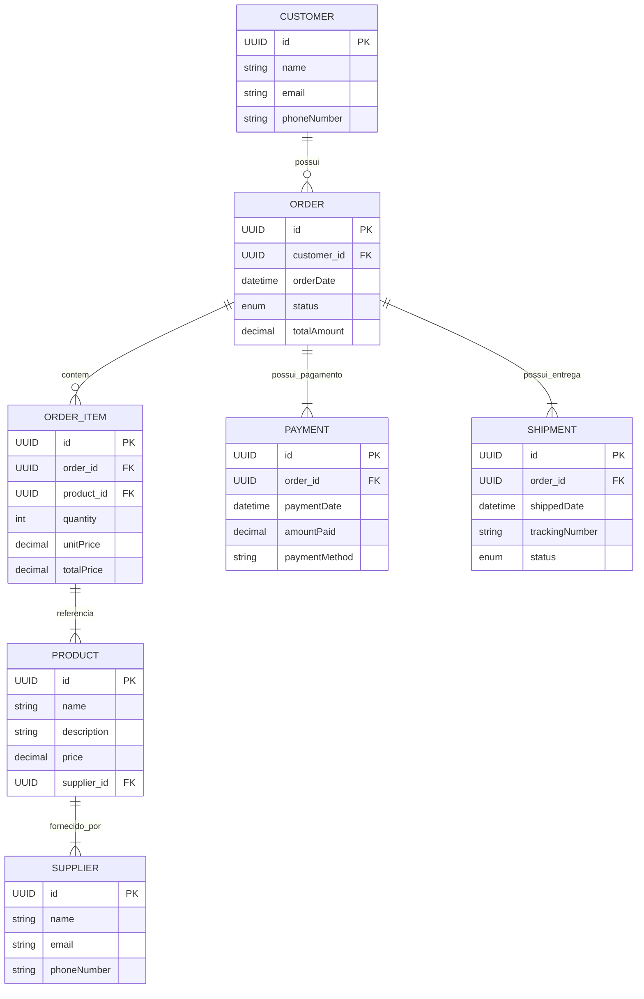

# Order Manager API

## Índice

1. [Descrição](#descrição)
2. [Tecnologias Utilizadas](#tecnologias-utilizadas)
3. [Estrutura do Projeto](#estrutura-do-projeto)
4. [Configurações](#configurações)
    - [application.yml](#applicationyml)
    - [pom.xml](#pomxml)
5. [Serviços](#serviços)
    - [CustomerService](#customerservice)
    - [OrderService](#orderservice)
    - [ProductService](#productservice)
    - [SupplierService](#supplierservice)
    - [ShipmentService](#shipmentservice)
6. [Endpoints](#endpoints)
    - [CustomerController](#customercontroller)
    - [OrderController](#ordercontroller)
    - [ProductController](#productcontroller)
    - [SupplierController](#suppliercontroller)
7. [Exceções](#exceções)
    - [Exceções Personalizadas](#exceções-personalizadas)
    - [GlobalExceptionHandler](#globalexceptionhandler)
8. [Modelo de Entidade Relacional](#modelo-de-entidade-relacional)
9. [Conclusão](#conclusão)

---

## Descrição

A **Order Manager API** é um sistema desenvolvido para o gerenciamento de pedidos, clientes, produtos, fornecedores e pagamentos. A API permite a criação, atualização, remoção e consulta dessas entidades, garantindo um fluxo eficiente de pedidos dentro de um sistema de e-commerce ou gestão empresarial.

## Tecnologias Utilizadas

- **Java 21**
- **Spring Boot 3.4.2**
- **Spring Data JPA**
- **Spring Boot Validation**
- **Spring Boot Cache**
- **Spring Boot Actuator**
- **SpringDoc OpenAPI**
- **Lombok**
- **MapStruct**
- **MySQL 8.0.33**
- **Flyway**

## Estrutura do Projeto

```
ordermanager/
│── src/
│   ├── main/
│   │   ├── java/br/com/ambevtech/ordermanager/
│   │   │   ├── controller/        # Controllers REST
│   │   │   ├── service/           # Serviços de regra de negócio
│   │   │   ├── repository/        # Camada de persistência (JPA Repositories)
│   │   │   ├── model/             # Entidades JPA
│   │   │   ├── dto/               # Data Transfer Objects (DTOs)
│   │   │   ├── exception/         # Tratamento de exceções
│   │   │   ├── mapper/            # Mapeamento de DTOs para entidades
│   │   │   ├── config/            # Configurações do projeto (Swagger, etc.)
│   │   │   ├── OrderManagerApplication.java  # Classe principal
│   │   ├── resources/
│   │   │   ├── application.yml    # Configuração do projeto
│   │   │   ├── db/migration/      # Scripts Flyway
│── pom.xml
│── README.md
```

## Configurações

### application.yml
```yaml
server:
  port: 8080

spring:
  application:
    name: order-manager

  datasource:
    url: jdbc:mysql://localhost:3306/ordermanager?createDatabaseIfNotExist=true&allowPublicKeyRetrieval=true&useSSL=false&serverTimezone=UTC
    username: root
    password: Xse1,lo0
    driver-class-name: com.mysql.cj.jdbc.Driver

  jpa:
    hibernate:
      ddl-auto: update
    show-sql: true
    database-platform: org.hibernate.dialect.MySQLDialect

springdoc:
  api-docs:
    path: /v3/api-docs
  swagger-ui:
    path: /swagger-ui.html
```

## Serviços

A camada de serviço da API encapsula a lógica de negócio e interage diretamente com o repositório de dados.
Cada serviço é responsável pelo processamento de operações essenciais relacionadas à sua entidade correspondente.

### `CustomerService`

Responsável pelo gerenciamento de clientes.

- **`getAllCustomers(Pageable pageable)`**: Retorna uma lista paginada de clientes.
- **`getCustomerById(UUID id)`**: Busca um cliente pelo ID.
- **`getCustomerByEmail(String email)`**: Busca um cliente pelo e-mail.
- **`createCustomer(CustomerRequestDTO dto)`**: Cria um novo cliente.
- **`updateCustomer(UUID id, CustomerRequestDTO dto)`**: Atualiza os dados de um cliente existente.
- **`deleteCustomer(UUID id)`**: Remove um cliente do sistema.

### `OrderService`

Gerencia pedidos dos clientes.

- **`getAllOrders(Pageable pageable)`**: Retorna uma lista paginada de pedidos.
- **`getOrderById(UUID id)`**: Busca um pedido pelo ID.
- **`getOrdersByCustomerId(UUID customerId, Pageable pageable)`**: Retorna todos os pedidos de um cliente específico.
- **`createOrder(OrderRequestDTO dto)`**: Cria um novo pedido associado a um cliente.

### `ProductService`

Gerencia os produtos cadastrados no sistema.

- **`getAllProducts(Pageable pageable)`**: Retorna uma lista paginada de produtos.
- **`getProductById(Long id)`**: Busca um produto pelo ID.
- **`createProduct(Product product)`**: Cadastra um novo produto.
- **`updateProduct(Long id, Product updatedProduct)`**: Atualiza os dados de um produto existente.
- **`deleteProduct(Long id)`**: Remove um produto do sistema.

### `SupplierService`

Responsável pelo gerenciamento de fornecedores.

- **`getAllSuppliers(Pageable pageable)`**: Retorna uma lista paginada de fornecedores.
- **`getSupplierById(Long id)`**: Busca um fornecedor pelo ID.
- **`createSupplier(Supplier supplier)`**: Cadastra um novo fornecedor.
- **`updateSupplier(Long id, Supplier updatedSupplier)`**: Atualiza os dados de um fornecedor existente.
- **`deleteSupplier(Long id)`**: Remove um fornecedor do sistema.

### `ShipmentService`

Gerencia as entregas dos pedidos.

- **`getAllShipments(Pageable pageable)`**: Retorna uma lista paginada de entregas.
- **`getShipmentById(UUID id)`**: Busca uma entrega pelo ID.
- **`createShipment(Shipment shipment)`**: Registra uma nova entrega.
- **`updateShipment(UUID id, Shipment updatedShipment)`**: Atualiza os dados de uma entrega existente.
- **`updateShipmentStatus(UUID id, ShipmentStatus status)`**: Atualiza o status da entrega.
- **`deleteShipment(UUID id)`**: Remove uma entrega do sistema.

## Endpoints

As controllers da API são responsáveis por expor os endpoints REST para interação com os recursos do sistema. Cada controller está bem estruturada, seguindo as práticas recomendadas do Spring Boot.

### `CustomerController`

Responsável pelo gerenciamento de clientes.

- <span style="color: green;">**GET**</span> `/api/customers` - Retorna uma lista paginada de clientes.
- <span style="color: green;">**GET**</span> `/api/customers/{id}` - Busca um cliente pelo ID.
- <span style="color: blue;">**POST**</span> `/api/customers` - Cria um novo cliente.
- <span style="color: orange;">**PUT**</span> `/api/customers/{id}` - Atualiza os dados de um cliente existente.
- <span style="color: red;">**DELETE**</span> `/api/customers/{id}` - Remove um cliente do sistema.

### `OrderController`

Responsável pelo gerenciamento de pedidos.

- <span style="color: blue;">**POST**</span> `/api/orders` - Cria um novo pedido associado a um cliente.
- <span style="color: green;">**GET**</span> `/api/orders` - Retorna uma lista paginada de pedidos.
- <span style="color: green;">**GET**</span> `/api/orders/{id}` - Busca um pedido pelo ID.
- <span style="color: green;">**GET**</span> `/api/orders/customer/{customerId}` - Retorna todos os pedidos de um cliente específico.

### `ProductController`

Gerencia os produtos disponíveis na plataforma.

- <span style="color: green;">**GET**</span> `/api/products` - Retorna uma lista paginada de produtos.
- <span style="color: green;">**GET**</span> `/api/products/{id}` - Busca um produto pelo ID.
- <span style="color: blue;">**POST**</span> `/api/products` - Cadastra um novo produto.
- <span style="color: orange;">**PUT**</span> `/api/products/{id}` - Atualiza um produto existente.
- <span style="color: red;">**DELETE**</span> `/api/products/{id}` - Remove um produto do sistema.

### `SupplierController`

Gerencia os fornecedores cadastrados no sistema.

- <span style="color: green;">**GET**</span> `/api/suppliers` - Retorna uma lista paginada de fornecedores.
- <span style="color: green;">**GET**</span> `/api/suppliers/{id}` - Busca um fornecedor pelo ID.
- <span style="color: blue;">**POST**</span> `/api/suppliers` - Cadastra um novo fornecedor.
- <span style="color: orange;">**PUT**</span> `/api/suppliers/{id}` - Atualiza os dados de um fornecedor.
- <span style="color: red;">**DELETE**</span> `/api/suppliers/{id}` - Remove um fornecedor do sistema.

## Exceções

O sistema possui um robusto mecanismo de tratamento de exceções para garantir que erros sejam tratados de maneira clara e estruturada. Abaixo estão as exceções personalizadas utilizadas na API:

### Exceções Personalizadas

- `CustomerNotFoundException` - Lançada quando um cliente não é encontrado no banco de dados.
- `OrderNotFoundException` - Lançada quando um pedido não é encontrado.
- `ProductNotFoundException` - Lançada quando um produto não é encontrado.
- `SupplierNotFoundException` - Lançada quando um fornecedor não é encontrado.
- `SupplierDuplicateEmailException` - Lançada quando há tentativa de cadastrar um fornecedor com um e-mail já existente.
- `ShipmentNotFoundException` - Lançada quando uma entrega não é encontrada.

### Detalhamento das Exceções

#### `GlobalExceptionHandler`

A classe `GlobalExceptionHandler` é responsável por capturar todas as exceções lançadas na aplicação e retornar respostas padronizadas para o cliente. Esta classe utiliza a anotação `@RestControllerAdvice`, garantindo que qualquer erro ocorra de forma centralizada.

**Principais Métodos:**

- `handleCustomerNotFoundException` - Captura exceções `CustomerNotFoundException` e retorna `404 Not Found`.
- `handleSupplierNotFoundException` - Captura exceções `SupplierNotFoundException` e retorna `404 Not Found`.
- `handleSupplierDuplicateEmailException` - Captura exceções `SupplierDuplicateEmailException` e retorna `400 Bad Request`.
- `handleDataIntegrityViolationException` - Captura exceções de integridade de banco de dados e retorna `400 Bad Request`.
- `handleValidationExceptions` - Captura erros de validação em requisições e retorna `400 Bad Request` com detalhes dos erros.
- `handleGenericException` - Captura exceções genéricas e retorna `500 Internal Server Error`.

Cada resposta de erro segue um padrão utilizando a classe `ErrorResponse`, que contém os seguintes campos:

```java
public record ErrorResponse(int status, String message, LocalDateTime timestamp, List<String> errors) {
    public ErrorResponse(int status, String message, LocalDateTime timestamp) {
        this(status, message, timestamp, null);
    }
}
```

Essa estrutura garante que todas as respostas de erro sejam consistentes e facilmente interpretáveis pelos clientes da API.


## Modelo de Entidade Relacional


## Conclusão

A **Order Manager API** foi projetada para oferecer um gerenciamento robusto e eficiente de pedidos e seus componentes. Com a estrutura modular e o uso de tecnologias modernas como Spring Boot, MySQL e MapStruct, a API permite uma fácil escalabilidade e manutenção. O sistema resolve o problema da organização de pedidos, fornecendo endpoints claros e bem documentados para cada entidade essencial ao fluxo de compras, tornando a gestão de pedidos mais ágil e segura.

Além disso, com a implementação de um tratamento avançado de exceções, a API fornece respostas padronizadas, garantindo uma melhor experiência do usuário e facilitando a depuração de erros. O uso de boas práticas, como separação de camadas e injeção de dependências, torna este sistema altamente sustentável e pronto para expansão.
